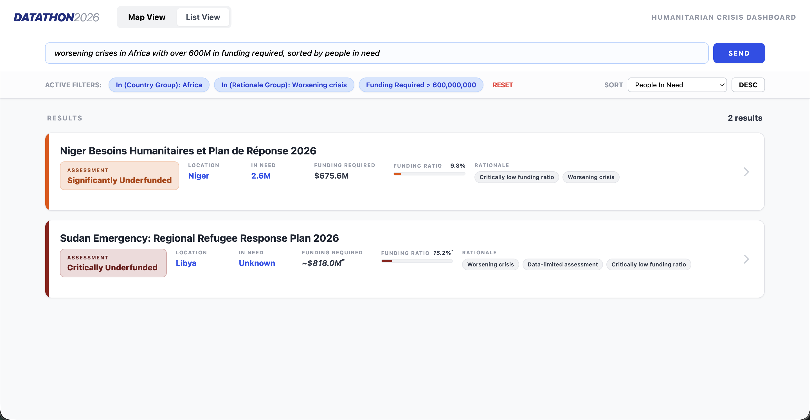
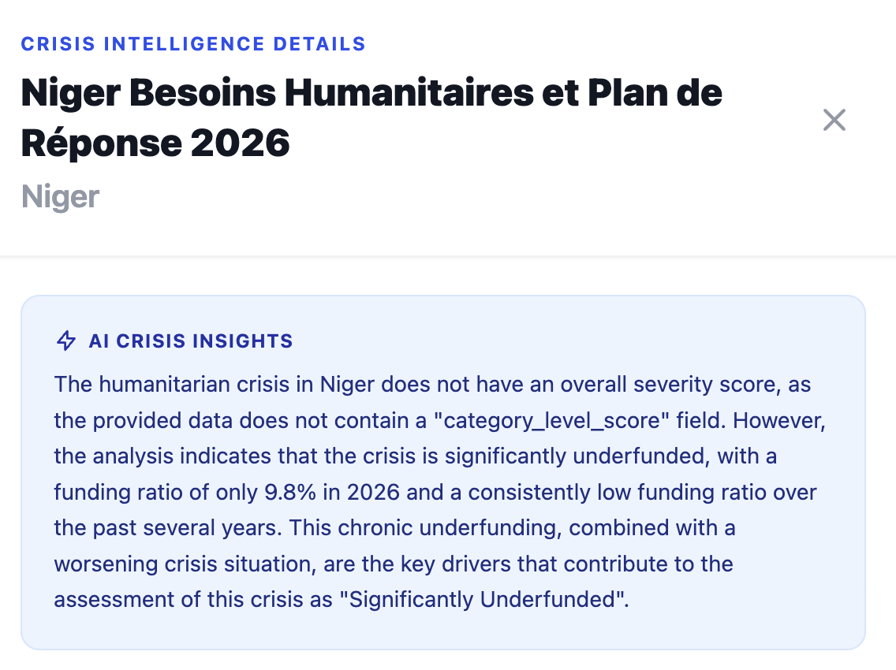

# Claude Side Challenge
We used Claude in two main ways inside the Crisis dashboard:

- To allow freeform natural language search across all crisis data, including structured and unstructured data.
- To generate concise, human-friendly summaries of the crisis situation, based on the available data.

## Search
The search is done as a Claude tool call with constrained output format. We defined a JSON schema for the expected output, which includes filtering operators (like "<", "IN", "EQUALS") and search fields, as well as sorting options. It even supports limit queries such as "10 crises with highest funding gaps". Through Claude, we can interpret complex natural language queries and translate them into structured search parameters that our dashboard can use to filter and sort the crisis data effectively.

## Summary
The summary feature feeds Claude with a structured prompt that includes key data points about the crisis, such as funding levels, requirements, affected population, and more. Claude then generates a concise summary that highlights the most critical information about the crisis, making it easier for users to quickly understand the situation without having to parse through all the raw data. This is especially useful for users who may not be familiar with interpreting complex datasets but need to grasp the essentials of the crisis at a glance.

